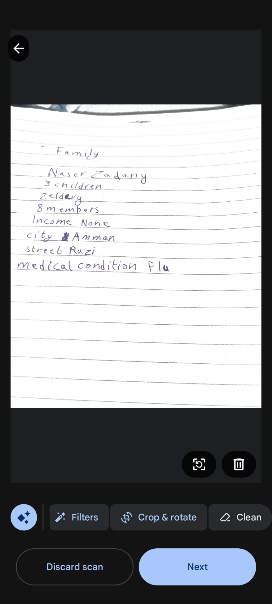
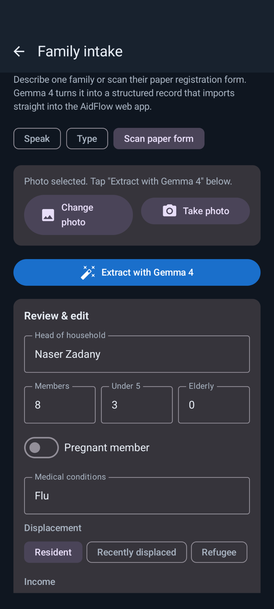
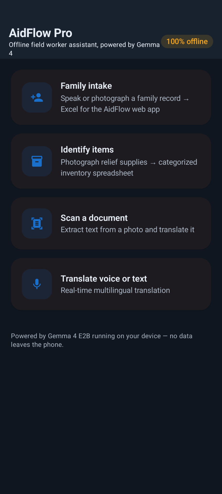
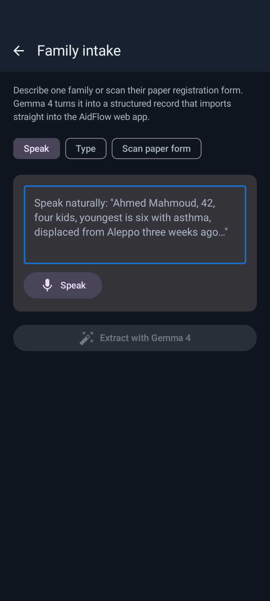
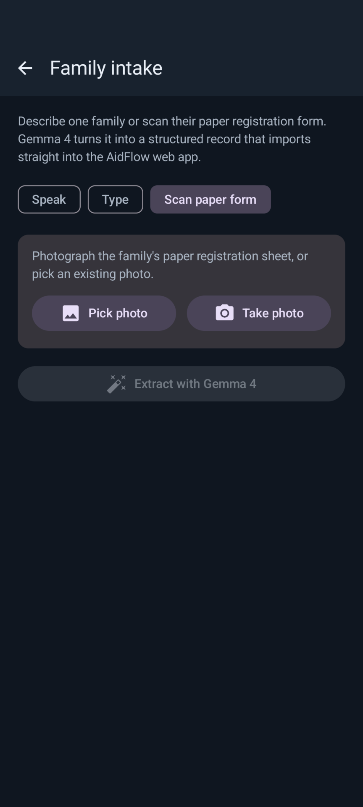
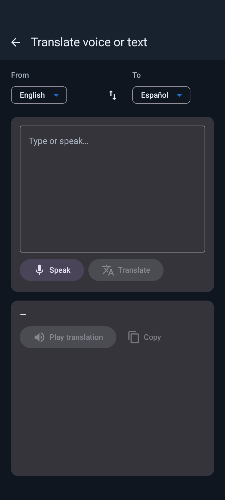

# AidFlow Pro — Mobile

> **Offline field worker assistant, powered by Gemma 4.**
> Android companion to the [AidFlow Pro web app](https://github.com/Cyberman-HZ/Aidflow).

[](#status)
[](LICENSE)
[](https://ai.google.dev/gemma)
[](#installing)

This project is **AidFlow Pro Mobile**, an Android app built for the
[Gemma 4 Good Hackathon](https://www.kaggle.com/competitions/gemma-4-good-hackathon/overview)
(Google DeepMind × Kaggle, $200K prize pool, submission deadline 2026-05-18).

---

## Status — Beta

This is an **early beta release**. The core flows are working and battle-tested
enough to demo, but expect rough edges: large model download on first launch,
multi-second inference latency on mid-range phones, and occasional language
gaps in the on-device speech recognizer. Not yet hardened for unsupervised
deployment in critical operations.

## What it is

AidFlow Pro Mobile is a **fully offline humanitarian aid assistant** designed
for **field aid workers** — the people doing intake at refugee camps, running
distribution lines at disaster sites, triaging in mobile clinics, and
communicating across language barriers where connectivity is unreliable.

Everything runs on the phone:

- **Gemma 4 E2B** (effective 2B-parameter multimodal model) via the LiteRT-LM
  runtime — text and vision used in this app (Gemma 4's audio modality is
  available in the model but not wired up yet).
- **ML Kit Text Recognition v2** for fast offline OCR.
- **Google Document Scanner** (Play Services on-device module) for camera +
  auto-crop + perspective correction.
- **Android system on-device speech recognizer** + **TextToSpeech**.

The only network traffic AidFlow Pro Mobile generates is two one-time
first-launch downloads: the Gemma 4 checkpoint (~2.6 GB from HuggingFace),
and the document-scanner module (~20 MB via Google Play Services). After
both are cached, everything runs in airplane mode — refugee camps,
evacuation shelters, remote clinics, conflict zones.

## How it relates to the AidFlow Pro web app

The [AidFlow Pro web app](https://github.com/Cyberman-HZ/Aidflow) is the
**desk-side coordination tool**: case management, priority triage, dispatch
orders, knowledge-base Q&A, reporting. It is itself offline-first and powered
by Gemma 4 (via Ollama).

**AidFlow Pro Mobile is its eyes and ears in the field.** Field workers
capture data on their phone while walking through camps or clinics; the web
app, running on a coordinator's laptop, picks it up for triage and
distribution.

The interop is **deliberate and zero-friction**:

- The mobile app's family-intake Excel exports name every column exactly as
  the web app's
  [`spreadsheetImport.ts`](https://github.com/Cyberman-HZ/Aidflow/blob/main/src/services/spreadsheetImport.ts)
  expects: `head_name`, `member_count`, `children_under_5`, `elderly_count`,
  `has_pregnant_member`, `medical_conditions`, `displacement_status`,
  `income_level`, `location_sector`, `street`, `city`, `notes`. All 12
  auto-map on import — no column-mapping prompts. The export also adds three
  mobile-only columns (`priority_score`, `priority_reason`, `id`) which the
  web app's importer keeps by appending them to the family's `notes` field
  (its safety behavior for unknown columns), so nothing is lost.
- Both apps use the **same 0–100 priority scale** and the **same
  CRITICAL / HIGH / MEDIUM / NORMAL level thresholds (80 / 60 / 40)**, so a
  family that arrives from the mobile app already sits in the same bucket as
  if the web app had scored it. The scoring engines are independent though:
  the web app applies a deterministic weighted-rule formula
  ([`priorityRules.ts`](https://github.com/Cyberman-HZ/Aidflow/blob/main/src/services/priorityRules.ts)),
  while the mobile app asks Gemma 4 to score from the family description
  using prose heuristics. Bucket usually agrees; individual numbers will not
  match exactly.

The two apps share a name on purpose — they are halves of the same system.

## Screenshots

### The headline demo: paper form → Gemma 4 → structured record

A handwritten paper registration form is photographed with the in-app
document scanner (auto-cropped + perspective-corrected by Google's on-device
model). Gemma 4 reads it and emits a structured family record matching the
AidFlow web app's exact schema — name, member counts, medical condition,
displacement status, all populated and editable.

<table>
  <tr>
    <td></td>
    <td></td>
  </tr>
  <tr>
    <td align="center"><b>1. Capture</b> — handwritten form, in-app scanner</td>
    <td align="center"><b>2. Extract</b> — Gemma 4 fills the canonical web-app fields</td>
  </tr>
</table>

### The rest of the app

<table>
  <tr>
    <td></td>
    <td></td>
  </tr>
  <tr>
    <td align="center">Home — four feature cards, "100% offline" badge</td>
    <td align="center">Family intake — speak naturally instead of typing</td>
  </tr>
  <tr>
    <td></td>
    <td></td>
  </tr>
  <tr>
    <td align="center">Family intake — scan-paper-form mode</td>
    <td align="center">Real-time voice + text translation</td>
  </tr>
</table>

More screenshots welcome under [`docs/screenshots/`](docs/screenshots/) — see
the [guide](docs/screenshots/README.md) for suggested filenames (Home,
Identify Items, Document Scan with translation, Export sheet, etc.).

---

## Features and their real-life impact

### 1. Voice & photo family intake → Excel

Field worker says *"Ahmed Mahmoud, 42, four kids, youngest is six with asthma,
displaced from Aleppo three weeks ago"* — or photographs a paper registration
form. Gemma 4 extracts a structured family record (head name, member counts,
medical conditions, displacement, income, location, priority score 0–100 with
reasoning). The worker reviews, edits, captures the next family, and exports
an Excel file that drops straight into the AidFlow web app.

**Impact.** Cuts a paper-intake cycle from **5+ minutes of typing per family
to ~30 seconds of speaking**. In mass-displacement events (recent earthquakes,
floods, conflict displacements have all required registering 1,000+ families
in a single day per camp), this turns a multi-hour backlog into a real-time
operation, and frees the worker to keep their eyes on the family they're
speaking with instead of a phone keyboard.

### 2. Identify items from a photo

Photograph relief supplies. Gemma 4's multimodal vision lists every distinct
item with a category (food / water / medical / shelter / hygiene / clothing /
education / other), quantity estimate, and unit. Stack multiple photos into
one inventory and export.

**Impact.** Rapid supply audits at distribution sites and warehouse
checkpoints — what used to be a clipboard-and-tally exercise becomes a
camera-and-confirm exercise. Helps coordinators know what's actually
available *before* dispatching aid orders.

### 3. Document scan + OCR + translation + export

Photograph a prescription, an intake form, a foreign-language sign, or a
medical history. ML Kit extracts text; Gemma 4 cleans up the OCR layout *or*
re-reads the image directly with multimodal vision; Gemma 4 then translates
into any of 20 languages. Export the result as TXT, CSV, PDF, or DOCX — and
choose what to include: original text only, translation only, or both.

**Impact.** Medical and legal documents become legible to caregivers in
their working language. A prescription written in Spanish becomes a PDF in
Arabic ready to share with a refugee family in seconds — fully offline, no
data leaves the phone.

### 4. Real-time voice and text translation

Speak in one language, get the translation read back in another. Works
offline (Android 13+ has a guaranteed on-device speech recognizer; on Android
12 we fall back to the system's offline preference). 20 supported languages
spanning the humanitarian use-case set (English, Spanish, French, Portuguese,
Arabic, Ukrainian, Russian, Polish, Turkish, Persian, Pashto, Urdu, Hindi,
Bengali, Swahili, Amharic, Somali, Chinese Simplified, Vietnamese, Tagalog).

**Impact.** Triage conversations across language barriers. A field clinic
volunteer can take a patient history from a Pashto-speaking mother while
working in English. An evacuation coordinator can deliver instructions in
Ukrainian without an interpreter on site.

### 5. Built-in camera with auto-crop and lens/flash control

Every photo input — Family Intake (paper form mode), Document Scan, and
Identify Items — has both a gallery picker and a Take-photo button. The
camera uses Google's on-device document scanner, which provides:

- Front/back lens switch
- Flash toggle (auto / on / off)
- Live edge detection with green corner outline
- Auto perspective correction (paper turned into a clean rectangle)
- Manual corner adjustment if the auto-detection guesses wrong
- Color / grayscale / B&W filter options
- Retake before confirming

**Impact.** Aid workers don't need a flatbed scanner or a clean working
surface. A crumpled paper form held at an angle on a folding table becomes a
near-perfect rectangular scan ready for OCR.

### 6. Offline-first, end-to-end

Gemma 4 runs on the phone via LiteRT-LM (CPU backend, XNNPack-accelerated).
ML Kit OCR runs on the phone. The document scanner runs on the phone. The
speech recognizer runs on the phone. TextToSpeech runs on the phone.

**Impact.** Works in places where humanitarian work most needs to work —
refugee camps and disaster zones with no mobile data, conflict zones where
sending data across borders would be unsafe, mobile clinics in rural areas
with intermittent coverage. **No data ever leaves the device.**

### 7. Web-app interop, no mapping required

The XLSX/CSV exporters target the AidFlow web app's exact canonical column
names. Mobile-captured data drops into the web app's spreadsheet import
dialog and is recognized field-by-field with no manual mapping.

**Impact.** A field team captures intake on five phones during a morning
shift. At lunch, the coordinator collects five Excel files via USB / Bluetooth
/ a local Wi-Fi share, drags them into the web app, and the case list is
populated, pre-triaged, and ready for distribution planning by the time the
team is back in the field.

---

## Installing the prebuilt APK

The signed debug APK (~154 MB) is published on the **[Releases page](../../releases/latest)**
because it exceeds GitHub's per-file size cap. Grab `AidFlowPro-debug.apk`
from the most recent release.

1. Copy the APK to your phone (USB, email, Drive — anything).
2. On the phone: **Settings → Apps → Install unknown apps** → enable for the
   file manager / browser you use to open the APK.
3. Tap the APK to install. Allow **camera** and **microphone** permissions
   when first asked.
4. Or via adb on a computer with the phone connected in developer mode:
   ```
   adb install AidFlowPro-debug.apk
   ```

Requirements: **Android 12+ (API 31)**, **3 GB free storage**, **2 GB free
RAM**. Voice translation works best on Android 13+ (API 33) where Google
ships a guaranteed on-device speech recognizer.

On first launch the app downloads `gemma-4-E2B-it.litertlm` (~2.6 GB) from
HuggingFace. Wi-Fi is strongly recommended; the in-app downloader gates on
unmetered networks unless you tick "allow mobile data."

## Testing the app — step-by-step walkthrough for judges

These flows are what to try, in order, to cover every Gemma 4 use case. Most
take under a minute once the model is loaded.

### Test 1 — First-launch model setup (~3 minutes on Wi-Fi)

1. Open AidFlow Pro for the first time. You land on the **One-time setup**
   screen.
2. Tap **Download model**. Watch the progress bar; ~2.6 GB downloads from
   HuggingFace.
3. After download, the screen says **"Loading Gemma 4 into memory…"**. This
   takes 60–90 s the first time (LiteRT-LM rebuilds the XNNPack kernel
   cache); subsequent app launches are ~15 s.
4. You should land on the Home screen with four feature cards and a
   "**100% offline**" badge.

### Test 2 — Family intake by voice → Excel for the web app (the headline demo)

1. From Home tap **Family intake**.
2. With **Speak** mode selected, tap the **Speak** button (allow microphone
   if asked) and say:
   > *"Ahmed Mahmoud, 42, four children, youngest is six with asthma,
   > displaced from Aleppo three weeks ago, no current income."*
3. Tap **Extract with Gemma 4**. After a few seconds you'll see a draft
   record: head name, member count, children-under-5, displacement chip set
   to *Recently displaced*, income chip set to *None*, a medical-conditions
   entry, and a **priority score** chip (typically `HIGH` for that
   description, somewhere in the 60–79 range — exact score is up to Gemma).
4. Edit anything that's wrong; tap **Save & start next family**.
5. Repeat with a second family.
6. Tap **Export to Excel / CSV**, pick **Excel (.xlsx) — Recommended**.
7. Snackbar says "Saved to Downloads — Share." Open the file in your phone's
   spreadsheet app. Verify columns match the **AidFlow web app's canonical
   schema**: `head_name, member_count, children_under_5, elderly_count,
   has_pregnant_member, medical_conditions, displacement_status,
   income_level, location_sector, street, city, notes, priority_score,
   priority_reason, id`.

### Test 3 — Family intake from a paper form (Gemma 4 vision)

1. Hand-write a quick family registration on paper (name, members, city,
   medical condition). Or use your existing intake sheets.
2. Family intake → tap **Scan paper form** chip.
3. Tap **Take photo**. The Google document scanner opens:
   - Notice the green edge-detection outline on the page.
   - Toggle **flash** and switch **lens** — the controls are in the
     scanner's overlay.
   - Capture. Adjust corners if the auto-detect missed; tap **Next**.
4. Back in AidFlow Pro tap **Extract with Gemma 4**. You should see fields
   populated from your handwriting.

### Test 4 — Identify items from a photo

1. From Home tap **Identify items**.
2. Tap **Take photo** and frame a stack of supplies (bottles, blankets,
   medicine boxes — anything that looks like aid inventory). The
   scanner is in BASE mode so it captures without forcing a tight crop.
3. After a few seconds you'll see a list with name / quantity / unit /
   category chips per item. Edit any field that's wrong.
4. Add more photos to stack a multi-photo inventory if you like.
5. Tap **Export inventory to Excel / CSV** and open the resulting XLSX.

### Test 5 — Translate a document end-to-end

1. From Home tap **Scan a document**.
2. Set **From** to the source language (e.g. Spanish) and **To** to the
   target language (e.g. English).
3. Tap **Take photo** of a foreign-language prescription / sign / form.
   The doc scanner is in FULL mode — it will auto-crop the page.
4. The "Original" card fills in with ML Kit's text. Tap **Clean with Gemma**
   to fix layout, or **Re-read with Gemma vision** to redo OCR entirely with
   Gemma 4's multimodal pipeline (slower but stronger on handwriting and
   non-Latin scripts).
5. Tap **Translate** — the "Translated" card appears with Gemma 4's output.
6. Tap **Export**. Choose scope (**Original / Translation / Both**) then a
   format (TXT / CSV / PDF / DOCX). Verify the file opens in Word / Excel /
   a PDF viewer.

### Test 6 — Real-time voice translation

1. From Home tap **Translate voice or text**.
2. Pick a source + target language pair. (E.g. English → Arabic.)
3. Tap **Speak** and say *"Where is the nearest hospital?"* — partial
   transcript appears live.
4. Stop speaking; after a few seconds the bottom card shows the translation.
5. Tap **Play translation** — TTS speaks it aloud in the target language.

### Test 7 — Offline guarantee

Put the phone in **airplane mode** and repeat Tests 2 – 6. Every feature
should still work. The only thing the app ever needs the network for is the
one-time model download in Test 1.

### Test 8 — Web-app interop check (optional, requires the AidFlow web app)

1. Capture 2–3 families in Test 2 and export the XLSX.
2. Transfer the file to a laptop running the
   [AidFlow Pro web app](https://github.com/Cyberman-HZ/Aidflow).
3. In the web app's **Import** dialog, select the XLSX. Notice that **every
   column maps automatically** — no manual mapping step required.
4. The imported families appear in the web app's family list with the
   priority scores already populated.

## Building from source

```bash
./gradlew testDebugUnitTest      # 31 unit tests
./gradlew assembleDebug          # writes app/build/outputs/apk/debug/app-debug.apk
./gradlew installDebug           # if a device is connected
```

Requires JDK 17 + Android SDK 34 + Gradle 8.7, or Android Studio Iguana or
newer. On Windows, you can use the bundled convenience wrapper (downloads
JDK + Gradle + SDK into `.tools/`):

```powershell
.\build.ps1 test
.\build.ps1 apk
```

## Architecture

```
                       ┌────────────────────┐
                       │  Jetpack Compose   │
                       │     UI screens     │
                       └─────────┬──────────┘
                                 │
                       ┌─────────▼──────────┐
                       │   ViewModels       │
                       │ Family / Items /   │
                       │ Scan / Translate / │
                       │ ModelSetup         │
                       └─────────┬──────────┘
                                 │
       ┌──────────┬──────────────┼──────────────┬───────────┐
       │          │              │              │           │
 ┌─────▼──┐ ┌─────▼────┐ ┌───────▼──────┐ ┌────▼─────┐ ┌────▼─────┐
 │ OCR    │ │ Doc      │ │ Translation  │ │ Speech   │ │ Intake   │
 │ ML Kit │ │ Scanner  │ │ Repository   │ │ Engine   │ │ Mapper   │
 └────────┘ │ ML Kit   │ └───────┬──────┘ │ + TTS    │ │ +JSON    │
            │ GMS      │         │        └──────────┘ │ extract  │
            └──────────┘         │                      └──────────┘
                                 │
                       ┌─────────▼──────────┐
                       │   Gemma4Manager    │
                       │  (LiteRT-LM API)   │
                       └─────────┬──────────┘
                                 │
                       ┌─────────▼──────────┐
                       │  gemma-4-E2B-it    │
                       │    .litertlm       │
                       └────────────────────┘
```

Detailed write-up: [`docs/ARCHITECTURE.md`](docs/ARCHITECTURE.md). Tuned
prompts: [`docs/PROMPT_CARDS.md`](docs/PROMPT_CARDS.md). Demo script:
[`docs/DEMO.md`](docs/DEMO.md).

## Tests

```bash
./gradlew testDebugUnitTest
```

31 unit tests across:

- **CSV / DOCX / XLSX / TXT exporters** — escaping (commas, quotes, newlines,
  BOM), OOXML structure, cell references past column Z, XML escaping.
- **JsonExtractor** — strips markdown fences, scans past preambles, handles
  nested braces inside string literals.
- **IntakeMapper** — 12-canonical-field round-trip, defensive defaults,
  loose enum normalization for `displacement_status` and `income_level`.
- **Languages** — every BCP-47 tag round-trips; RTL flags correct.
- **Prompts** — translate / OCR-cleanup / family-extraction prompt invariants.

## Submission information

- **Hackathon:** [Gemma 4 Good Hackathon](https://www.kaggle.com/competitions/gemma-4-good-hackathon/overview) (Kaggle × Google DeepMind, 2026).
- **Required model use:** Gemma 4 E2B is the sole inference engine for
  translation, OCR cleanup, family extraction (voice + photo), and item
  identification. Multimodal vision and structured-JSON output are both
  exercised. (Function-calling / tool-use is supported by LiteRT-LM but not
  used in this app — JSON output is parsed via a defensive extractor in
  [`JsonExtractor.kt`](app/src/main/java/com/aidflow/pro/intake/JsonExtractor.kt).)
- **Companion artifact:** [AidFlow Pro web app](https://github.com/Cyberman-HZ/Aidflow)
  (separate repository, same maintainer).

## License

[Apache 2.0](LICENSE). Gemma 4 model weights are governed by the [Gemma Terms
of Use](https://ai.google.dev/gemma/terms); downloading and running the model
implies acceptance.
